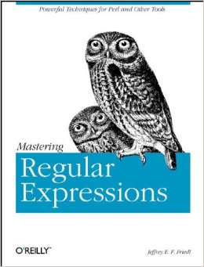
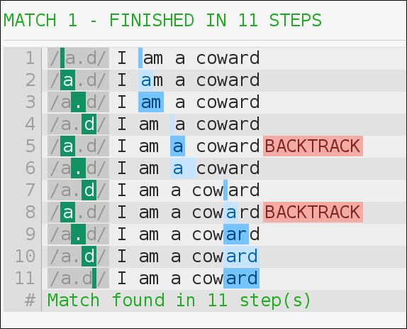
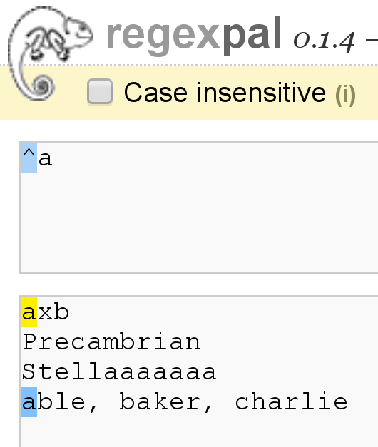
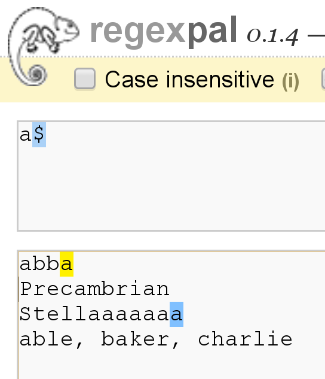
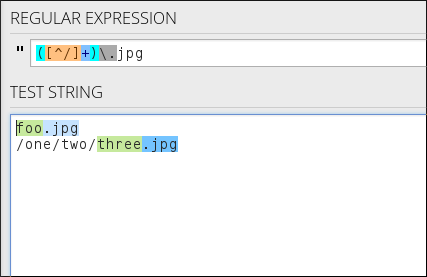

class: center, middle
background-image: url(images/feather.png)
# Introduction to mod_rewrite

* Rich Bowen - rbowen@apache.org
* @rbowen
* http://boxofclue.com/

---

<blockquote>
Despite the tons of examples and docs, mod_rewrite is voodoo. Damned
cool voodoo, but still voodoo.
</blockquote>

-- Brian Moore

---

## Shameless Plug

http://drbacchus.com/books/rewrite

---

# Agenda

* Intro to regular expressions
--
count:false
* mod_rewrite directives
    * RewriteRule
    * Rewrite Flags
    * RewriteCond
    * RewriteMap
--
count:false
* Related modules/directives
	* mod_substitute
	* mod_macro
    * FallbackResource
    * *Match
--
count:false
* The Expression Engine (2.4+)
* Per-request configuration (The `<If>` directive and friends)

---

## The Rules

* You must play along with examples, exercises
* Speak up when you have questions
* Speak up if I go too fast, too slow, skip around, whatever
* This class only works if you participate

---

class: center, middle
# Introduction to Regular Expressions

---

## Regular Expressions

- Atomic description of text patterns
- Start with a small vocabulary and work up
- Essential building block of mod_rewrite syntax
- PCRE

???
* Mastering Regular Expressions, Jeffrey Friedl - now in the 3rd
  edition.
* Perl Compatable Regular Expressions

---

## Testing/Experimenting

https://regex101.com/ - Full PCRE syntax, and explains each match.

???
Please open this site in your browser and keep it handy for the
remainder of the course. Thanks.

---

## Testing/Experimenting

http://cs.smu.ca/~porter/csc/355/regexpal/

???
Mentioned only because some of my screen shots use this tool.
regex101.com is vastly superior.

---

## Testing/Experimenting

https://www.debuggex.com/ - Interesting for learning more about how
regular expressions actually work.

---

## Regex vocabulary

We'll start with the basics and fill in more as we go along.

???
You don't need to know the whole language to understand conversation.
This small vocabulary will get you around most social situations.

---

## mod_rewrite regexes

* By default, everything is a substring match, not a full string match
* That is, the pattern can appear anywhere in the string (in the URL)

---

## Literal characters

* `a` matches a literal `a` in a string
* Reminder: All matches are substring matches
* That is, `a` matches `a`, but also matches `banana` and `watermelon`.

---

## .

- Wildcard character
- Matches one "atom"
- In mod_rewrite syntax, it matches a 'character'
- Use \\. if you want to match a literal "."

---

## .

`a.d` matches `acd`, `ardvark`, and `forward`

(Try it now - regex101.com)

--

---

???
Emphasize that regular expressions are substring matches, not
full-string matches. So putting .* on the beginning and end is bad, and
you should feel bad for doing it.

---

## Following the stack

`a.d` matches 'I am a coward'. Follow the matching process through to
give some appreciation for why it matters to craft regular expressions
well.

???
If you have a whiteboard, try to step through.

---

## Following the stack

---

## Tangent - 'Character' vs 'Byte'

???
In larger regex use (eg, Perl, Python, whatever) regexes match a
byte, not a character. This can cause confusion with UTF8, double-byte
characters, etc.

---

## Regular expressions in other 'languages'

* Many 'flavors' of regular expressions
* All (these days) are PCRE relatives, but they have local dialect

        /pony/i

???
Example shown uses delimiters (the slashes), and uses a modifier (the i,
meaning case-insensitive). This is common in many dialects, including
Perl, PHP, sed, and so on. mod_rewrite does *not* use these, however,
some other parts of Apache httpd do, as we'll see later.

---

## + \* ?

- Repetition characters
- Turns an 'atom' into a 'molecule'

---

## \+ - One or more

---

## \* - Zero or more

- a\* matches zero or more 'a' characters
- a
- aaaaa
- Also matches "Fish", which contains zero 'a' characters

---

## .*

- Remember, * matches zero or more
- And . matches anything
- So .* matches everything, and nothing

???
* .* matches every string, including the empty string
* It also gobbles up everything in sight - possible speed and memory
  implications
* Greedy

---

## ?

- Makes a match optional
- That is, matches zero or one
- "Lazy" - matches as little as possible

---

---

## .*?

- 'non-greedy' matching of everything
- Matches everything, but only as much as it needs to

Compare:

    .*a

vs

    .*?a

---

## .*a

???
regex101.com

Note how many steps are taken. Discuss what this means.

---

## .*?a

???
regex101.com

Note how many steps are taken. Discuss what this means.

---

## .*a

???
Click the "regex debugger" link at the left. (regex101.com)

---

## .*?a

---

## Exercise

- regex101.com, and try the following regular expressions on the string
  'Stellllaaaaaaaaaa!'

        a
        a+
        a+?
        a*
        a*?

- Discuss

???
mod_rewrite relevance: Make sure you say exactly what you mean, because
regular expressions take you literally.

Discuss why a* and a*? didn't do what we expected. Add the 'g' flag on
the end and see what this does differently.

---

## ^ and $

- Anchors
    - Starts with
    - Ends with

---

---

---

## `^$` and `^`

- `^$` is a special case - matches empty string
- starts with ends with (nothing between)
- `^` (all by itself) matches every string (including empty string)

---

## Discuss: `^` vs `.*`

???
- Faster
- Less memory used

---

## ( )

- Turns several atoms into a molecule (grouping)
- Can apply repetition characters to this molecule
- `(ab)+` matches "abababab"

---

## ( )

- Also "captures"
- The matched set of parentheses becomes $1 (or %1, depending ...)
- The next one $2, and so on
- Examples in just a moment

---

## Exercise

Tell me what the following regexes mean:

        \.jpg$
        (.*)\.html

---

## Advanced: Non-capturing ( )

    (?:abc)

Matches, but doesn't capture. Saves memory, which can matter in certain
scenarios.

???
?:

---

## Advanced: Negative lookahead

    ^/(?!images/)(.*)

... unless it starts with 'images/'

???
?!

Try this on regex101

Match against /foo/bar and against /images/foo/bar  Select 'python' to
avoid escaping the slashes.

---

## Discuss: `.*` vs `(.*)`

???
... vs just `^`

Don't capture unless you're actually going to use it later. Wastes time
and memory. This might matter on high-traffic sites.

---

## [ ]

- Character class
- Match one of these things

---

---

A character class is negated with a ^

        [^abc]
Matches anything EXCEPT a, b, c

---

## Exercise

Tell me what this means:

        ([^/]+)\.jpg$

* What's inside the ( )
* What will $1 contain
* What will it *not* contain?
* Try it out with various things on regex101.com

???
You may need to select `javascript` or `python` regexes to get this
syntax to work, because the site is silly about slashes.

---

???
Try ([^/]+)\.(jpg)$

---

## Not

- Any regex can be negated in a RewriteRule or RewriteCond by putting a ! in front of it

---

## Reading comprehension

        ^/

        [^/]

        ^[^/]

        !^/

---

## Reading comprehension

        ^/ - Starts with slash

        [^/] - Anything but a slash

        ^[^/] - Starts with anything but a slash

        !^/ - Doesn't start with a slash

???
Is there a difference between these last two things?

---

## (some|thing) - Alternation

* Parens can match a list of options

        cheap ?(jordan|uggs)

* (Example from spam-matching algorithm)
* This *also* captures as a side-effect

---

## URL-related example

        ([^/]+)\.(jpe?g|png|gif)

???
Exercise: Get the class to figure out what this matches, and what $1, $2
contain when we're done.

---

## Other regex uses

Other places you will use regular expressions once you master them:

- grep
- ack
- sed
- awk
- php
- python
- java
- mod_security
- SpamAssassin

---

class: center, middle

# mod_rewrite directives

---

## mod_rewrite

- mod_rewrite uses regular expressions to match requests (or other things), and modify them in some way (or not, depending)
- (And a lot of other things)

???
How's that for a concise definition?

---

## History

- Introduced in version 1.2 (so, basically from the beginning)
- Written by Ralf Engelschall
- Ralf is an evil genius. Also responsible for mod_ssl

---

## nginx

Note: Most of what you learn here is immediately applicable to nginx,
once you learn their syntax.

---

## URL Mapping

- The phase ("hook") of httpd processing where a URL gets translated
  into a resource
- A resource may be a file, a handler, an action (like a redirect), a
  proxy request, a status (like FORBIDDEN or NOT FOUND), etc
- mod_rewrite is one part of URL mapping

---

## URL Mapping - timing

- Usually happens early
- Can happen in .htaccess files (very late)
- This will matter to you at some point.

---

## mod_rewrite timing

- RewriteRule usually runs very early, in any given scope
- In particular, runs before other config lines in a .htaccess file or
  <Directory> block, for example

---

## Enabling the module

     LoadModule rewrite_module modules/mod_rewrite.so

---

## Enabling - Ubuntu/Debian

    a2enmod rewrite
    service httpd restart

Almost certainly on by default

---

## Enabling - CentOS/RHEL/Fedora

- Enabled by default
- Look for the `LoadModule` line if it's not
- This is in `/etc/httpd/conf.modules.d/00-base.conf` in the standard RPM
  build

???
Go show the file to them.

---

## RewriteEngine

    RewriteEngine On

* Defaults to 'off' and must be turned on in the scope where you wish to
  use it.
* Usually reasonable to turn this on globally
* Will need to turn it on per .htaccess file

---

## `<IfModule mod_rewrite.c>`

- Only executes If Module `mod_rewrite` is loaded
- Don't do this

???
You want to know (ie, via an error message) if your rewrite rules are
being ignored. Silently ignoring them is a Bad Thing.

---

## RewriteRule

    RewriteRule PATTERN TARGET

---

## RewriteRule

    RewriteRule *PATTERN* TARGET

If it matches *PATTERN*

---

## RewriteRule

    RewriteRule PATTERN *TARGET*

Do *TARGET* instead

---

## RewriteRule

    RewriteRule PATTERN TARGET *[flags]*

With some optional *tweaks*

---

---

## PATTERN

    RewriteRule PATTERN TARGET [flags]

- *PATTERN* is a regular expression (usually)
- Applied to the REQUEST_URI
- That's everything after http://hostname
- May be modified by context (eg, .htaccess files) or by earlier rewrite rules

---

## TARGET

    RewriteRule PATTERN TARGET [flags]

- *TARGET* is where you want it to go instead
- File path, or URI, or something else, depending on context and flags
- Or just `-` if you don't want to do anything

---

## flags

    RewriteRule PATTERN TARGET [flags]

- Optional
- Modify behavior of either the pattern or the target
- Some flags take additional arguments, eg `[S=12]`
- Can combine flags for additional super powers

---

## Example

    RewriteRule ^/images/(.*)\.jpg /pics/$1.gif [R=301]
--
count:false
**^/images/**

Starts with `/images/`

--
count:false
**(.*)**

Followed by zero or more characters (captured as $1)

--
count:false
**\.jpg**

Followed by a literal `.jpg`

---

## Example

    RewriteRule ^/images/(.*)\.jpg /pics/$1.gif [R=301]

**/pics/$1.gif**

Replace the matched URL with /pics/ followed by what was captured.

---

## Flags

    RewriteRule ^/images/(.*)\.jpg /pics/$1.gif [R=301]

**[R=301]**

- Modify behavior of a RewriteRule
- Default is to treat it as a **file path** relative to current location

---

## [R]
- Forces an external redirect, optionally with the specified HTTP status code. 
- Issues a redirect header to the client - URL in browser changes

        RewriteRule ^/images/(.*)\.jpg /pics/$1.gif [R=302]
        RewriteRule products http://products.example.org/ [R=301]

???
302=temp, 301=permanent

---

## Exercise

    RewriteRule ^/images/(.*)\.jpg /pics/$1.gif [R=301]

---

## Sidebar - Avoiding mod_rewrite

- mod_rewrite should be considered a last resort
- There's almost always a better (more efficient) way to do it.
- The [R] flag, for example, can often be replaced with a simple
  `Redirect` or `RedirectMatch`

---

## Compare ...

        RewriteRule ^/images/(.*)\.jpg /pics/$1.gif [R=302]
        Redirect /images /pics
        RedirectMatch ^/images/(.*)\.jpg /pics/$1.gif

        RewriteRule products http://products.example.org/ [R=301]
        Redirect /products/ http://products.example.org/
        RedirectMatch products http://products.example.org/

???
- Use rewrite when you've used other rewrite rules, so that you can
  control the order of operation.
- Order might be important - Rewrite (almost) always runs before Redirect,
  regarless of order in configuration file.
- Use mod_rewrite when you want to map transparently

---

## [PT]
- Forces the resulting URI to be passed back to the URL mapping engine for processing of other URI-to-filename translators, such as Alias or Redirect.
- Treat the target as a URI, processing it for URI-type things

        RewriteRule ^/products/(.+?)/ /prod.php?$1 [PT,L]

---

## [PT] - example

        Alias /images /var/www/images
        RewriteRule ^/pic/(.+) /images/$1 [PT]

???
Without the PT, you will *probably* get a 404 here.

---

## [B]
- Escape non-alphanumeric characters *before* applying the transformation.
- Preserves special characters in the URI through the rewriting process

---

## TODO [B] EXAMPLE

---

## [C]

- Rule is chained to the following rule. If the rule fails, the rule(s) chained to it will be skipped. 
- Use this when you need to do several transformations in a row as part of a single logical operation.

---

## TODO [C] EXAMPLE

---

## [CO]

- Sets a cookie in the client browser. 

        RewriteRule ^/index.html - \
            [CO=fontdoor:1:example.com]

- Full syntax is: 
        CO=NAME:VAL:domain[:lifetime
            [:path[:secure[:httponly]]]] 
- `-` as the target means "don't rewrite"

---

## [DPI]
- Causes the PATH_INFO portion of the rewritten URI to be discarded. 

---

## TODO [DPI] EXAMPLE AND EXPLANATION

---

## [ENV]

- Causes an environment variable VAR to be set (to the value VAL if provided). 
- The form !VAR causes the environment variable VAR to be unset.

        RewriteRule \.(png|gif|jpg)$ - [E=image:1]
        CustomLog logs/access_log combined env=!image

- Example: Don't log images

---

## [F]
- Returns a 403 FORBIDDEN response to the client browser.

        RewriteRule \.exe - [F]

---

TODO More [F] Examples

---

## [G]
- Returns a 410 GONE response to the client browser. 
- I've never actually used this flag.

---

## [H]

- Causes the resulting URI to be sent to the specified Content-handler for processing. 

        RewriteRule ^(/source/.+\.php)s$ \
          $1 [H=application/x-httpd-php-source]

- Example causes .phps requests to be processed by PHP's syntax-highlighter

--
count:false

Exercise -  Implement the above. Verify that you can visit a php file with
two different URLs (ie .php and .phps) with different results. 

???
Discuss the security implications of this fact.

---

## [L]
- Stop the rewriting process immediately and don't apply any more rules.
- Probably doesn't do what you expect in per-directory and .htaccess context
- (see also the END flag).

        RewriteBase /
        RewriteCond %{REQUEST_URI} !=/index.php
        RewriteRule ^(.*) /index.php?req=$1 [L,PT]

---

## Implied [L]

A number of flags imply [L], and take effect immediately

* [F]
* [R]
* [P]
* [PT]
* [G]

---

## [END]

- Stop the rewriting process immediately and don't apply any more rules.
- Also prevents further execution of rewrite rules in per-directory and .htaccess context. 
- (Available in 2.3.9 and later)
- Note that a rule issuing a REDIRECT to itself will still result in rules being re-run

Example - a RewriteRule in the main config, which you want to ensure is
not overridden by something appearing in a .htaccess file.

---

## [N]
- Re-run the rewriting process, starting again with the first rule, using the result of the ruleset so far as a starting point. 

        RewriteRule (.*)A(.*) $1B$2 [N]

- Example - global search and replace of A with B, looping until there's no more As
- Use [N=100] to limit to 100 iterations (2.4.8 and later)

---

## [NC]
- Makes the pattern comparison case-insensitive.

        RewriteRule (.*\.(jpg|gif|png))$ http://images.example.com$1 [P,NC]

---

## [NE]

- Prevent mod_rewrite from applying hexcode escaping of special characters in the result of the rewrite. 
- Not to be confused with [B]

---

## [NE]

        RewriteRule "^/anchor/(.+)" "/bigpage.html#$1" [NE,R]

The above example will redirect `/anchor/xyz` to `/bigpage.html#xyz`
Omitting the [NE] will result in the # being converted to its hexcode
equivalent, `%23`, which will then result in a 404 Not Found error
condition.

---

## [NS]

- Causes a rule to be skipped if the current request is an internal sub-request.
- Subrequests are things like server-side includes, or a -U check ("Does
  this URL exist?" check. See later.)

---

## [P]
- Force the substitution URL to be internally sent as a proxy request. 

        RewriteRule (.*\.(jpg|gif|png))$ http://images.example.com$1 [P,NC]

- Proxy to back-end image server
- [P] implies [L] - ie, do it now

---

## [P]

- [P] invokes mod_proxy, and so that must be installed
- Like `ProxyPass`, but without the same fine-grained control of proxy
  variables
- You should still use `ProxyPassReverse`

        RewriteRule (.*\.(jpg|gif|png))$ http://images.example.com$1 [P,NC]
        ProxyPassReverse / http://images.example.com/

---

## [QSA]
- Appends any query string from the original request URL to any query string created in the rewrite target.
- That is, it preserves the user-submitted query string, in addition to the one you created

        RewriteRule /pages/(.+) /page.php?page=$1 [QSA]

---

## [QSA]

        RewriteRule /pages/(.+) /page.php?page=$1 [QSA]

With QSA, `/pages/thingy?arg=value` maps to `/page.php?arg=value&page=thingy`

Without QSA, `/pages/thingy?arg=value` maps to `/page.php?page=thingy`

---

## [QSD]

- Discard any query string attached to the incoming URI. 
- This does the opposite of [QSA]
- By default, a rewrite/redirect will preserve query strings (except
  when you use [QSA]. Some people (mistakenly) believe that this harms
  search engine placement. So [QSD] explicitly drops the query string
  from rewritten values.

Be very very cautious about using this for security, unless you can be
certain there's no way around it.

???
Ah, SEO, is there anything you can't do?

---

## [QSD]

        RewriteRule /pages/(.+) /page.php/$1 [QSD]

Perhaps we don't trust the user, and think that they might inject extra
query string arguments, or we just want to be sure we have complete
control over what our app is receiving.

???
So, either SEO or paranoia

---

## [S]

- Tells the rewriting engine to skip the next num rules if the current rule matches.
- Like a GOTO statement for rewrite rules
- Consider using `<If>` and `<Else>` instead (later today)

        # Is the request for a non-existent file?
        RewriteCond %{REQUEST_FILENAME} !-f
        RewriteCond %{REQUEST_FILENAME} !-d
        # If so, skip these two RewriteRules
        RewriteRule .? - [S=2]
        RewriteRule (.*\.gif) images.php?$1
        RewriteRule (.*\.html) docs.php?$1

More about `RewriteCond` in a bit.

---

## [T]
- Force the MIME-type of the target file to be the specified type. 

        # Serve .php files as plain text
        RewriteRule \.php$ - [T=text/plain]

---

class: center, middle

# .htaccess files.

---

## .htaccess files
- .htaccess files are for local (per-directory) configuration
- mod_rewrite assumes you only care about the current directory
- Leading directory path is stripped off of everything

---

Syntax in .htaccess files:

        # In httpd.conf
        RewriteRule ^/images/(.+)\.jpg /images/$1.png

--
count:false
        # In .htaccess in root dir
        RewriteBase /
        RewriteRule ^images/(.+)\.jpg images/$1.png

--
count:false
        # In .htaccess in images/
        RewriteBase /images/
        RewriteRule ^(.+)\.jpg $1.png

In Apache HTTP Server 2.4.16 and later, RewriteBase may be omitted
when the request is mapped via Alias or mod_userdir.

---

## .htaccess files

- Late acting. Rules are applied after URL mapping is already finished,
  and has mapped you to a directory
- This means you probably can't bypass directory-based authentication,
  for example

---

## .htaccess files - Caveats

- [L] probably doesn't mean what you initially think it does.
- Control often returned back up to main URL mapping process, which may
  result in the .htaccess file being invoked again.

---

# RewriteCond

---

## RewriteCond
- Additional condition on a rewrite
- Can consult any variable, not just REQUEST_URI
- Can evaluate arbitrary expressions

---

---

## RewriteCond - example

Redirect based on client address

        RewriteCond %{REMOTE_ADDR} ^10\.2\.
        RewriteRule (.*) http://intranet.example.com$1

---

## RewriteCond - example

Loop avoidance (did we already do this?)

        RewriteCond %{REQUEST_URI} !^/images
        RewriteRule (.+\.(jpg|gif|png))$ /images/$1 [PT]

Otherwise, a request for `/images/whotsit.png` will be rewritten to
`/images/images/whotsit.png`. Rinse. Repeat

---

# Backreferences

        RewriteCond %{HTTP_HOST} (.*)
        RewriteRule ^/(.*) /sites/%1/$1

- RewriteRule backreferences: $1, $2, $3, etc
- RewriteCond backreferences: %1, %2, %3, etc

---

## Flow

---

## -f and -d
- `-f` - Is it a file?
- `-d` - Is it a directory?

        RewriteCond /var/www%{REQUEST_URI} !-f
        RewriteCond /var/www%{REQUEST_URI} !-d

        RewriteRule ^ /index.php [PT,L]

index.php can examine `$_SERVER['REQUEST_URI']` for the original request

???
See also FallbackResource (Later)

---

## Others
- -s - is a file with non-zero size
- -U - resolves to a valid URL - This is SLOW
- -x - is an executable file

---

## -U

        RewriteCond %{REQUEST_URI} !-U
        RewriteRule (.+) http://other.site$1 [R,L]

- Follows proxy referrals, redirects, aliases, and so on
- Can be very slow
- Can be useful for "check elsewhere" kinds of rules, rather than simply
  returning a 404.

---

## LA-U
- Look-ahead for a variable that hasn't been set yet
- For example, use this for auth user, which is set *after* rewrite phase

        RewriteCond %{LA-U:REMOTE_USER} (.+)
        RewriteRule (.*) http://people.example.org/%1/$1   [R,L]

- This is usually a subrequest - see [NS] flag.
- Like -U, can be very slow, and possibly inaccurate.

---

## Expressions
- Evaluate arbitrary logical expressions

        RewriteCond expr "! %{HTTP_REFERER} \
            -strmatch '*://%{HTTP_HOST}/*'"
        RewriteRule ^/images - [F]
---

See later Expressions section

---

## RewriteCond ... what else?

- %{ENV:variable} - any environment variable
- %{SSL:variable} - any SSL variable
- %{HTTP:header} - any HTTP header

---

## RewriteCond - condition pattern

- Usually a PCRE, but can also be ...

---

## RewriteCond - condition pattern - string comparisons

- Lexical string comparisions, rather then regex
    - <, >, =, >=, <=, or !=
- Numerical comparisions
    - -eq, -ge, -gt, -le, -lt, -ne

---

## RewriteCond - file test attributes

* -d Is directory.
* -f Is regular file.
* -F Is existing file, via subrequest.
* -h Is symbolic link, bash convention.
* -l Is symbolic link.
* -L Is symbolic link, bash convention.
* -s Is regular file, with size.
* -U Is existing URL, via subrequest.
* -x Has executable permissions.

???
You've already seen some of these. Here's the full list.

---

## Example

Check somewhere else ...

        RewriteCond /var/www/%{REQUEST_URI} !-f
        RewriteRule ^(.+) /other/archive/$1 [R]

---

## Example

        RewriteCond expr "! %{HTTP_REFERER} -strmatch '*://%{HTTP_HOST}/*'"
        RewriteRule "^/images" "-" [F]

---

## RewriteCond Flags

- Like RewriteRule, but fewer of them
- [OR] - Subsequent rules are OR'ed rather than AND'ed
- [NC] - Conds are applied in a case-insensitive manner
- [NV] - If a HTTP header is used in the condition, this flag prevents this header from being added to the Vary header of the response. 

???
Using [NV] might break proper caching of the response if the
representation of this response varies on the value of this header. So
this flag should be only used if the meaning of the Vary header is well
understood.

---

## One last example - flow control

        RewriteCond  "%{HTTP_USER_AGENT}"  "(iPhone|Blackberry|Android)"
        RewriteRule  "^/$"                 "/homepage.mobile.html"  [L]

        RewriteRule  "^/$"                 "/homepage.std.html"     [L]

Thought Exercise - work through the various possibilities, and convince
yourself that this does in fact work as desired.

???
The second RewriteRule, in conjuction with the [L] flag, acts as an ELSE
clause

---

class: center, middle

# RewriteMap

---

## RewriteMap
* External map which can be used in a RewriteRule
- 1-1 mapping
- DB lookup
- Some kind of programmatic thingy

---

## RewriteMap

    RewriteMap MapName MapType:MapSource

eg.

    RewriteMap examplemap txt:/path/to/file/map.txt
    RewriteRule ^/ex/(.*) ${examplemap:$1}

Think of `RewriteMap` as defining a function, or macro, which you can
then call in your `RewriteRule` or `RewriteCond` directive.

---

## RewriteMap example

        RewriteMap product2id \
            txt:/etc/apache2/productmap.txt
        RewriteRule ^/product/(.*) \
             /prods.php?id=${product2id:$1|NOTFOUND} [PT]

NOTFOUND is returned in the case that the lookup fails.

---

## Map file

        ##
        ## productmap.txt - Product to ID map file
        ##
            
        television 993
        stereo 198
        fishingrod 043
        basketball 418
        telephone 328

File lookup is sequential - thus, potentially slow for large files.

---

## RewriteMap exercise

Set up a simple txt RewriteMap which maps band names to product IDs.

Steps:

* Create map file
* Add RewriteMap directive
* Add RewriteRule directive using that map
* Test

---

## Map types

- txt: Plain text maps
- rnd: Randomized Plain Text
- dbm: DBM Hash File
- int: Internal Function
- prg: External Rewriting Program
- dbd or fastdbd: SQL Query

---

## rnd

        ##
        ## map.txt -- rewriting map
        ##
        
        static www1|www2|www3|www4
        dynamic www5|www6

---

## rnd

    RewriteMap servers rnd:/path/to/file/map.txt
    RewriteRule ^/(.*\.(png|gif|jpg)) http://${servers:static}/$1 [NC,P,L]
    RewriteRule ^/(.*) http://${servers:dynamic}/$1 [P,L]

This is the so-called "poor man's load balancing" recipe.

---

## rnd - weighted randomization

        ##
        ## map.txt -- rewriting map
        ##
        
        banner  sponsor1|sponsor2|sponsor2|sponsor3

... if sponsor1 and sponsor3 are gold sponsors, and sponsor2 is a
platinum sponsor, for example.

---

## dbm

- Exactly like the text mapping, in concept and syntax
- Much faster/scalable in practice

Convert your map from txt to dbm with:

        httxt2dbm -i rewritemap.txt -o rewritemap.dbm

You can then reference the resulting file in your RewriteMap directive:

        RewriteMap mapname "dbm:/etc/apache/mapfile.map"

---

## RewriteMap - dbm

- Update dbm, without having restart httpd - file timestamp is checked
  (`stat`) with each request.
- Otherwise, file contents are cached in memory for very fast lookups

---

## int

- Provides a few internal macros that you can invoke in your maps
- Far less useful than it sounds

---

## RewriteMap - int

- toupper: Converts the key to all upper case.
- tolower: Converts the key to all lower case.
- escape: Translates special characters in the key to hex-encodings.
- unescape: Translates hex-encodings in the key back to special characters.

---

## RewriteMap int example

    RewriteMap lc int:tolower
    RewriteRule (.*?[A-Z]+.*) ${lc:$1} [R]

---

## prg

- Calls an external program to process a rewrite mapping
- Almost always a bad idea
- Blocking - all requests funneled through the same running instance.
  Can cause serious performance impact.
- Program isn't launched each time, but is launched on startup, and kept
  running, so must expected streamed input/output

---

## RewriteMap prg example

        RewriteMap d2u prg:/www/bin/dash2under.pl
        RewriteRule - ${d2u:%{REQUEST_URI}}

With a script like ...

        #!/usr/bin/perl
        $| = 1; # Turn off I/O buffering
        while (<STDIN>) {
            s/-/_/g; # Replace dashes with underscores
            print $_;
        }

---

## RewriteMap prg

- Was possibly more useful before we had the dbd/fastdbd map type. Even
  then it was questionable.

---

## dbd

- Call a SQL query to do your mapping
- Uses mod_dbd for database connectivity

    RewriteMap myquery \
        "dbd:SELECT destination FROM rewrite WHERE source = %s"

---

## dbd setup

- Set up database connection with mod_dbd

        DBDriver mysql
        DBDParams host=localhost,dbname=pony,user=pony,pass=pony

- one persistent connection per child

- Create map

        RewriteEngine On
        RewriteMap pony "dbd:SELECT stable FROM pony WHERE name= %s"
        RewriteRule ^/(pony.+) /stable/${pony:$1} [R]

---

## dbd vs fastdbd

- dbd makes the query with each request
- fastdbd caches responses until server restart

---
class: center, middle

# Rewrite Logging

---

Logging - 2.2 and earlier

    RewriteLog /var/log/httpd/rewrite.log
    RewriteLogLevel 9
Then ...

    tail -f /var/log/httpd/rewrite.log

---

Logging - 2.4 and later

    ErrorLog /var/log/httpd/error.log
    LogLevel warn rewrite:trace6
Then ...

    tail -f /var/log/httpd/error.log | grep rewrite

---

## Logging

[Fri Sep 09 16:27:23.013851 2016] [rewrite:trace2] [pid 30254]
mod_rewrite.c(477): [client 127.0.0.1:51440] 127.0.0.1 - -
[localhost/sid#56363b94b400][rid#56363bbf53a0/initial] init rewrite
engine with requested uri /pony1
[Fri Sep 09 16:27:23.013891 2016] [rewrite:trace3] [pid 30254]
mod_rewrite.c(477): [client 127.0.0.1:51440] 127.0.0.1 - -
[localhost/sid#56363b94b400][rid#56363bbf53a0/initial] applying pattern
'^/(pony.+)' to uri '/pony1'
[Fri Sep 09 16:27:23.014161 2016] [rewrite:trace5] [pid 30254]
mod_rewrite.c(477): [client 127.0.0.1:51440] 127.0.0.1 - -
[localhost/sid#56363b94b400][rid#56363bbf53a0/initial] SQL map lookup
OK: map pony key=pony1, val=1
[Fri Sep 09 16:27:23.014183 2016] [rewrite:trace2] [pid 30254]
mod_rewrite.c(477): [client 127.0.0.1:51440] 127.0.0.1 - -
[localhost/sid#56363b94b400][rid#56363bbf53a0/initial] rewrite '/pony1'
-> '/stable/1'
[Fri Sep 09 16:27:23.014189 2016] [rewrite:trace2] [pid 30254]
mod_rewrite.c(477): [client 127.0.0.1:51440] 127.0.0.1 - -
[localhost/sid#56363b94b400][rid#56363bbf53a0/initial] explicitly
forcing redirect with http://localhost/stable/1
[Fri Sep 09 16:27:23.014194 2016] [rewrite:trace1] [pid 30254]
mod_rewrite.c(477): [client 127.0.0.1:51440] 127.0.0.1 - -
[localhost/sid#56363b94b400][rid#56363bbf53a0/initial] escaping
http://localhost/stable/1 for redirect
[Fri Sep 09 16:27:23.014201 2016] [rewrite:trace1] [pid 30254]
mod_rewrite.c(477): [client 127.0.0.1:51440] 127.0.0.1 - -
[localhost/sid#56363b94b400][rid#56363bbf53a0/initial] redirect to
http://localhost/stable/1 [REDIRECT/302]
[Fri Sep 09 16:27:23.029757 2016] [rewrite:trace2] [pid 30254]
mod_rewrite.c(477): [client 127.0.0.1:51440] 127.0.0.1 - -
[localhost/sid#56363b94b400][rid#56363bbf93c0/initial] init rewrite
engine with requested uri /stable/1

---

Yeah, that was a lot of line noise. Let's try that again.

---

## Rewrite log entry

        [Fri Sep 09 16:27:23.013891 2016] [rewrite:trace3] [pid 30254]
        mod_rewrite.c(477): [client 127.0.0.1:51440] 127.0.0.1 - -
        [localhost/sid#56363b94b400][rid#56363bbf53a0/initial] applying pattern
        '^/(pony.+)' to uri '/pony1'

--

Let's break it down ...

---

## Timestamp

        [Fri Sep 09 16:27:23.013891 2016] 

Time stamp. Nothing exciting here.

---

## Module and loglevel

        [rewrite:trace3] 

This is the module that is logging, and what log level it logged at.
Thus, if you set trace2 rather than trace6 in your ErrorLogLevel
directive, you wouldn't see this one.

---

## pid

        [pid 30254]

The process ID, in the Unix process list.

---

## source code reference

        mod_rewrite.c(477): 

Which line of source code, in which source code file, was responsible
for this particular log message. In case you want to go looking.

---

## Client info

        [client 127.0.0.1:51440] 127.0.0.1 - -

Client address, and the server it was talking to.

---

## sid

        [localhost/sid#56363b94b400]

The SID is the Server ID - unique per vhost. This is useful if you have
multiple vhosts logging the same place, and want to split out just one
vhost. However, there's no obvious way to determine your SID other than
pawing through the log file.

---

## rid

        [rid#56363bbf53a0/initial]

This is the Request ID. All log entries from the same HTTP request will
have the same Request ID. This is very useful in debugging what happened
in a particular rewrite rule set, by isolating a particular request.

initial, as opposed to subrequest.

---

## Log message

        applying pattern '^/(pony.+)' to uri '/pony1'

The actual log message. This can be extremely useful, as it tells you
eactly what regex is being applied to exactly what URI. Remember back in
the .htaccess section - the URI that it's being applied to might not
always be what you expect, and here's how you make certain.

---

## Inspecting the Rewrite log entries

For the most part, visually discard the first part of every log entry ...

        init rewrite engine with requested uri /pony1

        applying pattern '^/(pony.+)' to uri '/pony1'

        SQL map lookup OK: map pony key=pony1, val=1

        rewrite '/pony1' -> '/stable/1'

        explicitly forcing redirect with http://localhost/stable/1

        escaping http://localhost/stable/1 for redirect

        redirect to http://localhost/stable/1 [REDIRECT/302]

---

## Next request

This is the next request ...

        init rewrite engine with requested uri /stable/1

- You can tell because the rid changed
- Also because of the 'init rewrite engine' bit.

---

## Let's try the same thing with the rule in a .htaccess file ...

        RewriteEngine On
        RewriteRule ^(pony.+) /stable/${pony:$1} [R]

Note missing leading slash in pattern.

---

## And the log entries ...

	[perdir /home/rbowen/devel/presentations/] strip per-dir prefix: /home/rbowen/devel/presentations/pony1 -> pony1
	[perdir /home/rbowen/devel/presentations/] applying pattern '^(pony.+)' to uri 'pony1'
	SQL map lookup OK: map pony key=pony1, val=1
	[perdir /home/rbowen/devel/presentations/] rewrite 'pony1' -> '/stable/1'
	[perdir /home/rbowen/devel/presentations/] explicitly forcing redirect with http://localhost/stable/1
	[perdir /home/rbowen/devel/presentations/] escaping http://localhost/stable/1 for redirect
	[perdir /home/rbowen/devel/presentations/] redirect to http://localhost/stable/1 [REDIRECT/302]

And this is the next request:

	init rewrite engine with requested uri /stable/1

???
Draw particular attention to the uri 'pony1' as opposed to '/pony1'

---

## Trying one more time, with a slightly different rule:

        RewriteEngine On
        RewriteRule ^(pony.+) /stable/${pony:$1} 

In this case, rather than redirecting, we're doing a transparent local
rewrite.

---

## The log entries ...

	[perdir /home/rbowen/devel/presentations/] strip per-dir prefix: /home/rbowen/devel/presentations/pony1 -> pony1
	[perdir /home/rbowen/devel/presentations/] applying pattern '^(pony.+)' to uri 'pony1'
	SQL map lookup OK: map pony key=pony1, val=1
	[perdir /home/rbowen/devel/presentations/] rewrite 'pony1' -> 'stable/1'
	[perdir /home/rbowen/devel/presentations/] add per-dir prefix: stable/1 -> /home/rbowen/devel/presentations/stable/1
	[perdir /home/rbowen/devel/presentations/] strip document_root prefix: /home/rbowen/devel/presentations/stable/1 -> /stable/1
	[perdir /home/rbowen/devel/presentations/] internal redirect with /stable/1 [INTERNAL REDIRECT]

If you keep following the log, you'll see more entries with `[rid#55a50d798720/initial/redir#1]` - ie, same request, but second pass through, when the request hits the .htaccess file the second time.

---

## Exercise: Rewrite Logging

Enable your rewrite log, and go back to look at the other `RewriteRule`
examples we've done, to see their logging patterns. Compare
configurations in `httpd.conf` vs `.htaccess`.

---

## RewriteOptions

* Configures certain twiddly bits of mod_rewrite
* Usually will not need to meddle with this, but, in case you do ...

---

TODO Cleanup on aisle 9

## RewriteOptions Inherit
This forces the current configuration to inherit the configuration of the parent. In per-virtual-server context, this means that the maps, conditions and rules of the main server are inherited. In per-directory context this means that conditions and rules of the parent directory's .htaccess configuration or <Directory> sections are inherited. The inherited rules are virtually copied to the section where this directive is being used. If used in combination with local rules, the inherited rules are copied behind the local rules. The position of this directive - below or above of local rules - has no influence on this behavior. If local rules forced the rewriting to stop, the inherited rules won't be processed.

---

Rules inherited from the parent scope are applied after rules specified in the child scope.
## RewriteOptions InheritBefore
Like Inherit above, but the rules from the parent scope are applied before rules specified in the child scope.
Available in Apache HTTP Server 2.3.10 and later.

---

## RewriteOptions InheritDown
If this option is enabled, all child configurations will inherit the configuration of the current configuration. It is equivalent to specifying RewriteOptions Inherit in all child configurations. See the Inherit option for more details on how the parent-child relationships are handled.
Available in Apache HTTP Server 2.4.8 and later.

---

## RewriteOptions InheritDownBefore
Like InheritDown above, but the rules from the current scope are applied before rules specified in any child's scope.
Available in Apache HTTP Server 2.4.8 and later.

---

## RewriteOptions IgnoreInherit
This option forces the current and child configurations to ignore all rules that would be inherited from a parent specifying InheritDown or InheritDownBefore.
Available in Apache HTTP Server 2.4.8 and later.

---

## RewriteOptions AllowNoSlash
By default, mod_rewrite will ignore URLs that map to a directory on disk but lack a trailing slash, in the expectation that the mod_dir module will issue the client with a redirect to the canonical URL with a trailing slash.

When the DirectorySlash directive is set to off, the AllowNoSlash option can be enabled to ensure that rewrite rules are no longer ignored. This option makes it possible to apply rewrite rules within .htaccess files that match the directory without a trailing slash, if so desired.
Available in Apache HTTP Server 2.4.0 and later.

---

## RewriteOptions AllowAnyURI
When RewriteRule is used in VirtualHost or server context with version 2.2.22 or later of httpd, mod_rewrite will only process the rewrite rules if the request URI is a URL-path. This avoids some security issues where particular rules could allow "surprising" pattern expansions (see CVE-2011-3368 and CVE-2011-4317). To lift the restriction on matching a URL-path, the AllowAnyURI option can be enabled, and mod_rewrite will apply the rule set to any request URI string, regardless of whether that string matches the URL-path grammar required by the HTTP specification.
Available in Apache HTTP Server 2.4.3 and later.

Security Warning

Enabling this option will make the server vulnerable to security issues if used with rewrite rules which are not carefully authored. It is strongly recommended that this option is not used. In particular, beware of input strings containing the '@' character which could change the interpretation of the transformed URI, as per the above CVE names.
MergeBase
With this option, the value of RewriteBase is copied from where it's explicitly defined into any sub-directory or sub-location that doesn't define its own RewriteBase. This was the default behavior in 2.4.0 through 2.4.3, and the flag to restore it is available Apache HTTP Server 2.4.4 and later.

---

## RewriteOptions IgnoreContextInfo
When a relative substitution is made in directory (htaccess) context and RewriteBase has not been set, this module uses some extended URL and filesystem context information to change the relative substitution back into a URL. Modules such as mod_userdir and mod_alias supply this extended context info. Available in 2.4.16 and later.

---

# mod_substitute

TODO

---

# mod_proxy_html

TODO

---

# mod_macro

TODO

---

# FallbackResource

TODO

---

Front controller

        <Directory /var/www/my_blog>
          RewriteBase /my_blog
          RewriteCond /var/www/my_blog/%{REQUEST_FILENAME} !-f
          RewriteCond /var/www/my_blog/%{REQUEST_FILENAME} !-d
          RewriteRule ^ index.php [PT]
        </Directory>
Or ...

        <Directory /var/www/my_blog>
          FallbackResource index.php
        </Directory>

---

# *match directives

TODO

---

# Expression engine

TODO

---

# <If> and friends

---

If/Else syntax

        <If "$req{Host} != 'www.wooga.com'">
            RedirectMatch (.*) http://www.wooga.com$1
        </If>

---

# Bonus Slides

---

# mod_security

TODO

---

## Rewrite Recipes

---

Look somewhere else ...

        RewriteEngine on
        
        #   first try to find it in dir1/...
        #   ...and if found stop and be happy:
        RewriteCond         %{DOCUMENT_ROOT}/dir1/%{REQUEST_URI}  -f
        RewriteRule  ^(.+)  %{DOCUMENT_ROOT}/dir1/$1  [L]
        
        #   second try to find it in dir2/...
        #   ...and if found stop and be happy:
        RewriteCond         %{DOCUMENT_ROOT}/dir2/%{REQUEST_URI}  -f
        RewriteRule  ^(.+)  %{DOCUMENT_ROOT}/dir2/$1  [L]
        
        #   else go on for other Alias or ScriptAlias directives,
        #   etc.
        RewriteRule   ^  -  [PT]

---

Prevent hotlinking 

        RewriteEngine on
        RewriteCond %{HTTP_REFERER} !^$
        RewriteCond %{HTTP_REFERER} !example.com [NC]
        RewriteRule \.(gif|jpg|png)$ - [F]
or ...

        RewriteEngine on
        RewriteCond %{HTTP_REFERER} !^$
        RewriteCond %{HTTP_REFERER} !example.com [NC]
        RewriteRule \.(gif|jpg|png)$ /images/goaway.gif [R,L]

---

Images should be from local pages: (Prevent image "hotlinking")

        <FilesMatch \.(jpg|png|gif)$>
            <If "%{HTTP_HOST} !~ 'example.com'>
                Require all denied
            </If>
        </FilesMatch>

---

# Finis
