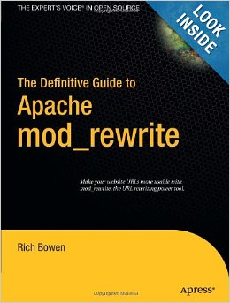
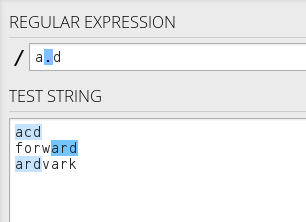
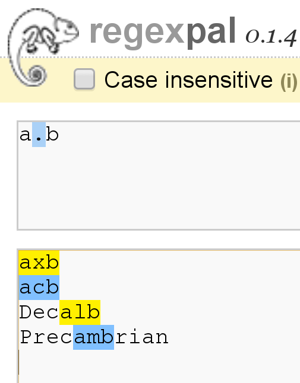
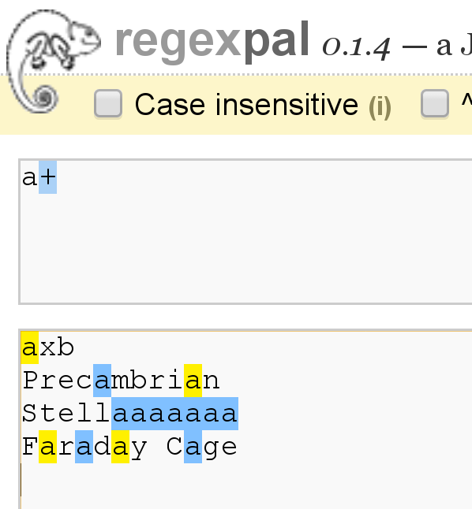
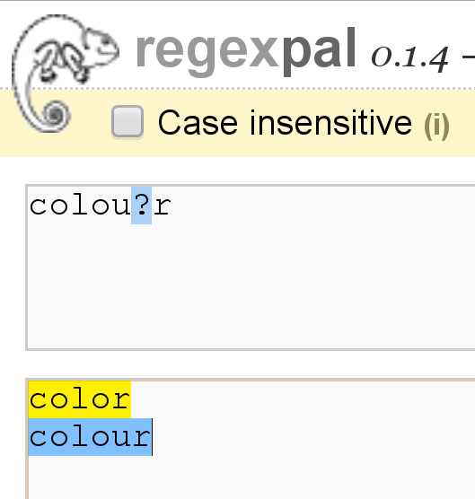
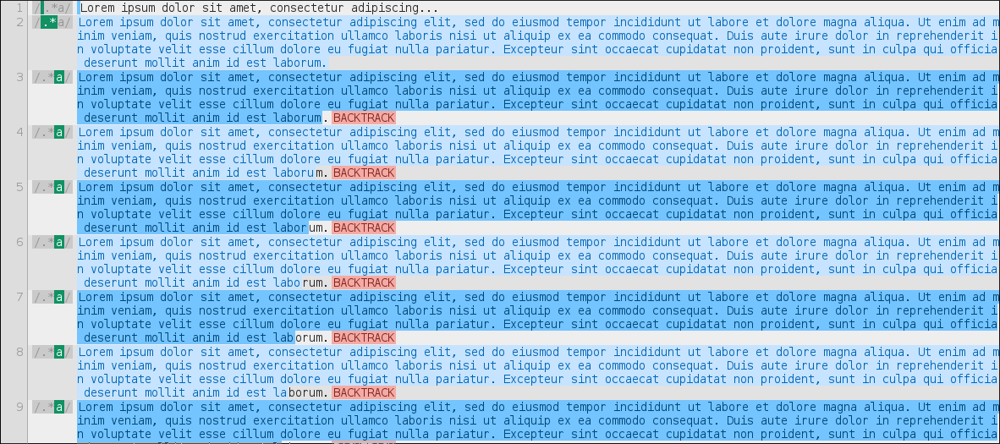
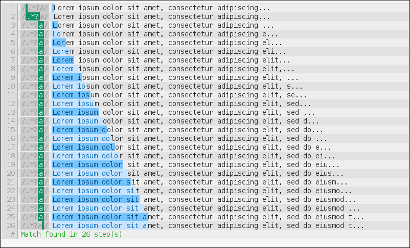
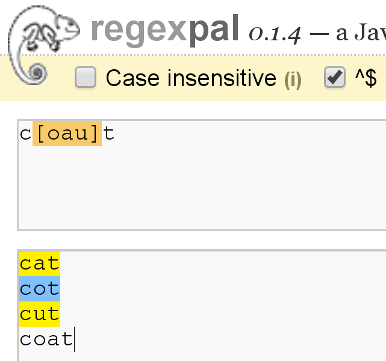

class: center, middle
background-image: url(images/feather.png)
# Introduction to mod_rewrite

* Rich Bowen - rbowen@apache.org
* @rbowen
* http://boxofclue.com/

---

<blockquote>
Despite the tons of examples and docs, mod_rewrite is voodoo. Damned
cool voodoo, but still voodoo.
</blockquote>

-- Brian Moore

---

## Shameless Plug

http://drbacchus.com/books/rewrite

---

# Agenda

* Intro to regular expressions
--
count:false
* mod_rewrite directives
    * RewriteRule
    * Rewrite Flags
    * RewriteCond
    * RewriteMap
--
count:false
* Related modules/directives
	* mod_substitute
	* mod_macro
    * FallbackResource
    * *Match
--
count:false
* The Expression Engine (2.4+)
* Per-request configuration (The `<If>` directive and friends)

---

## The Rules

* You must play along with examples, exercises
* Speak up when you have questions
* Speak up if I go too fast, too slow, skip around, whatever
* This class only works if you participate

---

class: center, middle
# Introduction to Regular Expressions

---

## Regular Expressions

- Atomic description of text patterns
- Start with a small vocabulary and work up
- Essential building block of mod_rewrite syntax
- PCRE

???
* Mastering Regular Expressions, Jeffrey Friedl - now in the 3rd
  edition.
* Perl Compatable Regular Expressions

---

## Testing/Experimenting

https://regex101.com/ - Full PCRE syntax, and explains each match.

???
Please open this site in your browser and keep it handy for the
remainder of the course. Thanks.

---

## Testing/Experimenting

http://cs.smu.ca/~porter/csc/355/regexpal/

???
Mentioned only because some of my screen shots use this tool.
regex101.com is vastly superior.

---

## Regex vocabulary

We'll start with the basics and fill in more as we go along.

???
You don't need to know the whole language to understand conversation.
This small vocabulary will get you around most social situations.

---

## mod_rewrite regexes

* By default, everything is a substring match, not a full string match
* That is, the pattern can appear anywhere in the string (in the URL)

---

## Literal characters

* `a` matches a literal `a` in a string
* Reminder: All matches are substring matches
* That is, `a` matches `a`, but also matches `banana` and `watermelon`.

---

## .

- Wildcard character
- Matches one "atom"
- In mod_rewrite syntax, it matches a 'character'
- Use \\. if you want to match a literal "."

---

## .

`a.d` matches `acd`, `ardvark`, and `forward`

(Try it now)

---

## Tangent - 'Character' vs 'Byte'

???
In larger regex use (eg, Perl, Python, whatever) regexes match a
byte, not a character. This can cause confusion with UTF8, double-byte
characters, etc.

---

---

## Regular expressions in other 'languages'

* Many 'flavors' of regular expressions
* All (these days) are PCRE relatives, but they have local dialect

        /pony/i

???
Example shown uses delimiters (the slashes), and uses a modifier (the i,
meaning case-insensitive). This is common in many dialects, including
Perl, PHP, sed, and so on. mod_rewrite does *not* use these, however,
some other parts of Apache httpd do, as we'll see later.

---

## + \* ?

- Repetition characters
- Turns an 'atom' into a 'molecule'

---

## \+ - One or more

---

## \* - Zero or more

- a\* matches zero or more 'a' characters
- a
- aaaaa
- Also matches "Fish", which contains zero 'a' characters

---

## .*

- Remember, * matches zero or more
- And . matches anything
- So .* matches everything, and nothing

???
* .* matches every string, including the empty string
* It also gobbles up everything in sight - possible speed and memory
  implications
* Greedy

---

## ?

- Makes a match optional
- That is, matches zero or one
- "Lazy" - matches as little as possible

---

---

## .*?

- 'non-greedy' matching of everything
- Matches everything, but only as much as it needs to

Compare:

    .*a

vs

    .*?a

---

## .*a

???
regex101.com

Note how many steps are taken. Discuss what this means.

---

## .*?a

???
regex101.com

Note how many steps are taken. Discuss what this means.

---

## .*a

???
Click the "regex debugger" link at the left. (regex101.com)

---

## .*a

---

## Exercise

- regex101.com, and try the following regular expressions on the string
  'Stellllaaaaaaaaaa!'

        a
        a+
        a+?
        a*
        a*?

- Discuss

???
mod_rewrite relevance: Make sure you say exactly what you mean, because
regular expressions take you literally.

Discuss why a* and a*? didn't do what we expected. Add the 'g' flag on
the end and see what this does differently.

---

## ^ and $

- Anchors
    - Starts with
    - Ends with

---

---

---

## `^$` and `^`

- `^$` is a special case - matches empty string
- starts with ends with (nothing between)
- `^` (all by itself) matches every string (including empty string)

---

## Exercise

Tell me what the following regexes mean:

        \.jpg$
        (.*)\.html

---

## Discuss: `^` vs `.*`

???
- Faster
- Less memory used

---

## ( )

- Turns several atoms into a molecule (grouping)
- Can apply repetition characters to this molecule
- `(ab)+` matches "abababab"

---

## ( )

- Also "captures"
- The matched set of parentheses becomes $1 (or %1, depending ...)
- The next one $2, and so on
- Examples in just a moment

---

## Advanced: Non-capturing ( )

    (?:abc)

Matches, but doesn't capture. Saves memory, which can matter in certain
scenarios.

??
?:

---

## Advanced: Negative lookahead

    ^/(?!images/)(.*)

... unless it starts with 'images/'

???
?!

---

## Discuss: `.*` vs `(.*)`

???
... vs just `^`

---

## [ ]

- Character class
- Match one of these things

---

---

A character class is negated with a ^

        [^abc]
Matches anything EXCEPT a, b, c

---

## Exercise

Tell me what this means:

        ([^/]+)\.jpg$

* What's inside the ( )
* What will $1 contain
* What will it *not* contain?
* Try it out with various things on regex101.com

???
You may need to select `javascript` or `python` regexes to get this
syntax to work, because the site is silly about slashes.

---

---

## Not

- Any regex can be negated in a RewriteRule or RewriteCond by putting a ! in front of it

---

## Reading comprehension

        ^/

        [^/]

        ^[^/]

        !^/

---

## Reading comprehension

        ^/ - Starts with slash

        [^/] - Anything but a slash

        ^[^/] - Starts with anything but a slash

        !^/ - Doesn't start with a slash

???
Is there a difference between these last two things?

---

## Other regex uses

Other places you will use regular expressions once you master them:

- grep
- ack
- sed
- awk
- php
- python
- java

---

class: center, middle

# mod_rewrite directives

---

## mod_rewrite

- mod_rewrite uses regular expressions to match requests (or other things), and modify them in some way (or not, depending)
- (And a lot of other things)

???
How's that for a concise definition?

---

## History

- Introduced in version 1.2 (so, basically from the beginning)
- Written by Ralf Engelschall
- Ralf is an evil genius. Also responsible for mod_ssl

---

## Enabling the module

     LoadModule rewrite_module modules/mod_rewrite.so

---

## Enabling - Ubuntu/Debian

    a2enmod rewrite

Almost certainly on by default

---

## Enabling - CentOS/RHEL/Fedora

- Enabled by default
- Look for the `LoadModule` line if it's not

---

## RewriteEngine

    RewriteEngine On

* Defaults to 'off' and must be turned on in the scope where you wish to
  use it.
* Usually reasonable to turn this on globally

---

## `<IfModule mod_rewrite.c>`

- Only executes If Module `mod_rewrite` is loaded
- Don't do this

???
You want to know (ie, via an error message) if your rewrite rules are
being ignored. Silently ignoring them is a Bad Thing.

---

## RewriteRule

    RewriteRule PATTERN TARGET

---

## RewriteRule

    RewriteRule *PATTERN* TARGET

If it matches *PATTERN*

---

## RewriteRule

    RewriteRule PATTERN *TARGET*

Do *TARGET* instead

---

## RewriteRule

    RewriteRule PATTERN TARGET *[flags]*

With some optional *tweaks*

---

---

## PATTERN

    RewriteRule PATTERN TARGET [flags]

- *PATTERN* is a regular expression (usually)
- Applied to the REQUEST_URI
- That's everything after http://hostname
- May be modified by context (eg, .htaccess files) or by earlier rewrite rules

---

## TARGET

    RewriteRule PATTERN TARGET [flags]

- *TARGET* is where you want it to go instead
- File path, or URI, or something else, depending on context and flags
- Or just `-` if you don't want to do anything

---

## flags

    RewriteRule PATTERN TARGET [flags]

- Optional
- Modify behavior of either the pattern or the target
- Some flags take additional arguments, eg `[S=12]`
- Can combine flags for additional super powers

---

## Example

    RewriteRule ^/images/(.*)\.jpg /pics/$1.gif [R=301]
--
count:false
**^/images/**

Starts with `/images/`

--
count:false
**(.*)**

Followed by zero or more characters (captured as $1)

--
count:false
**\.jpg**

Followed by a literal `.jpg`

---

## Example

    RewriteRule ^/images/(.*)\.jpg /pics/$1.gif [R=301]

**/pics/$1.gif**

Replace the matched URL with /pics/ followed by what was captured.

---

## Flags

    RewriteRule ^/images/(.*)\.jpg /pics/$1.gif [R=301]

**[R=301]**

- Modify behavior of a RewriteRule
- Default is to treat it as a **file path** relative to current location

---

## [R]
- Forces an external redirect, optionally with the specified HTTP status code. 
- Issues a redirect header to the client - URL in browser changes

        RewriteRule ^/images/(.*)\.jpg /pics/$1.gif [R=302]
        RewriteRule products http://products.example.org/ [R=301]

???
302=temp, 301=permanent

---

## Sidebar - Avoiding mod_rewrite

- mod_rewrite should be considered a last resort
- There's almost always a better (more efficient) way to do it.
- The [R] flag, for example, can often be replaced with a simple
  `Redirect` or `RedirectMatch`

---

## Compare ...

        RewriteRule ^/images/(.*)\.jpg /pics/$1.gif [R=302]
        Redirect /images /pics
        RedirectMatch ^/images/(.*)\.jpg /pics/$1.gif

        RewriteRule products http://products.example.org/ [R=301]
        Redirect /products/ http://products.example.org/
        RedirectMatch products http://products.example.org/

???
- Use rewrite when you've used other rewrite rules, so that you can
  control the order of operation.
- Order might be important - Rewrite (almost) always runs before Redirect,
  regarless of order in configuration file.

---

## [PT]
- Forces the resulting URI to be passed back to the URL mapping engine for processing of other URI-to-filename translators, such as Alias or Redirect.
- Treat the target as a URI, processing it for URI-type things

        RewriteRule ^/products/(.+?)/ /prod.php?$1 [PT,L]

---

## [PT] - example

        Alias /images /var/www/images
        RewriteRule ^/pic/(.+) /images/$1 [PT]

???
Without the PT, you will *probably* get a 404 here.

---

## [B]
- Escape non-alphanumeric characters *before* applying the transformation.
- Preserves special characters in the URI through the rewriting process

---

## TODO [B] EXAMPLE

---

## [C]

- Rule is chained to the following rule. If the rule fails, the rule(s) chained to it will be skipped. 
- Use this when you need to do several transformations in a row as part of a single logical operation.

---

## TODO [C] EXAMPLE

---

## [CO]

- Sets a cookie in the client browser. 

        RewriteRule ^/index.html - \
            [CO=fontdoor:1:example.com]

- Full syntax is: 
        CO=NAME:VAL:domain[:lifetime
            [:path[:secure[:httponly]]]] 
- `-` as the target means "don't rewrite"

---

## [DPI]
- Causes the PATH_INFO portion of the rewritten URI to be discarded. 

---

## TODO [DPI] EXAMPLE AND EXPLANATION

---

## [ENV]

- Causes an environment variable VAR to be set (to the value VAL if provided). 
- The form !VAR causes the environment variable VAR to be unset.

        RewriteRule \.(png|gif|jpg)$ - [E=image:1]
        CustomLog logs/access_log combined env=!image

- Example: Don't log images

---

## [F]
- Returns a 403 FORBIDDEN response to the client browser.

        RewriteRule \.exe - [F]

---

TODO More [F] Examples

---

## [G]
- Returns a 410 GONE response to the client browser. 
- I've never actually used this flag.

---

## [H]

- Causes the resulting URI to be sent to the specified Content-handler for processing. 

        RewriteRule ^(/source/.+\.php)s$ \
          $1 [H=application/x-httpd-php-source]

- Example causes .phps requests to be processed by PHP's syntax-highlighter

---

## [L]
- Stop the rewriting process immediately and don't apply any more rules.
- Probably doesn't do what you expect in per-directory and .htaccess context
- (see also the END flag).

        RewriteBase /
        RewriteCond %{REQUEST_URI} !=/index.php
        RewriteRule ^(.*) /index.php?req=$1 [L,PT]

---

TODO, what implies L? [F], [R], [P], and so on.

---

## [END]
- Stop the rewriting process immediately and don't apply any more rules.
- Also prevents further execution of rewrite rules in per-directory and .htaccess context. 
- (Available in 2.3.9 and later)
- Note that a rule issuing a REDIRECT to itself will still result in rules being re-run

---

## [N]
- Re-run the rewriting process, starting again with the first rule, using the result of the ruleset so far as a starting point. 

        RewriteRule (.*)A(.*) $1B$2 [N]

- Example - global search and replace of A with B, looping until there's no more As
- Use [N=100] to limit to 100 iterations (2.4.8 and later)

---

## [NC]
- Makes the pattern comparison case-insensitive.

        RewriteRule (.*\.(jpg|gif|png))$ http://images.example.com$1 [P,NC]

---

## [NE]
- Prevent mod_rewrite from applying hexcode escaping of special characters in the result of the rewrite. * Not to be confused with [B]

---

TODO [NE] example

---

## [NS]

- Causes a rule to be skipped if the current request is an internal sub-request. 

---

## [P]
- Force the substitution URL to be internally sent as a proxy request. 

        RewriteRule (.*\.(jpg|gif|png))$ http://images.example.com$1 [P,NC]
- Proxy to back-end image server

---

TODO [P] examples, with ProxyPassReverse

---

## [QSA]
- Appends any query string from the original request URL to any query string created in the rewrite target.
- That is, it preserves the user-submitted query string, in addition to the one you created

        RewriteRule /pages/(.+) /page.php?page=$1 [QSA]

---

## [QSD]
- Discard any query string attached to the incoming URI. 

---

TODO QSD example and justification.

---

## [S]

- Tells the rewriting engine to skip the next num rules if the current rule matches.
- Like a GoTo statement for rewrite rules
- Consider using `<If>` and `<Else>` instead

        # Is the request for a non-existent file?
        RewriteCond %{REQUEST_FILENAME} !-f
        RewriteCond %{REQUEST_FILENAME} !-d
        # If so, skip these two RewriteRules
        RewriteRule .? - [S=2]
        RewriteRule (.*\.gif) images.php?$1
        RewriteRule (.*\.html) docs.php?$1

---

## [T]
- Force the MIME-type of the target file to be the specified type. 

        # Serve .pl files as plain text
        RewriteRule \.pl$ - [T=text/plain]

---

TODO [T] exercise

---

class: center, middle

# .htaccess files.

---

## .htaccess files
- .htaccess files are for local (per-directory) configuration
- mod_rewrite assumes you only care about the current directory
- Leading directory path is stripped off of everything

---

Syntax in .htaccess files:

        # In httpd.conf
        RewriteRule ^/images/(.+)\.jpg /images/$1.png

--
count:false
        # In .htaccess in root dir
        RewriteBase /
        RewriteRule ^images/(.+)\.jpg images/$1.png

--
count:false
        # In .htaccess in images/
        RewriteBase /images/
        RewriteRule ^(.+)\.jpg $1.png

???
Always use RewriteBase. It's not generally necessary, but it aids
comprehension by the poor slob who has to maintain it later.

---

## RewriteCond
- Additional condition on a rewrite
- Can consult any variable, not just REQUEST_URI
- Can evaluate arbitrary expressions

---

---

Redirect based on client address

        RewriteCond %{REMOTE_ADDR} ^10\.2\.
        RewriteRule (.*) http://intranet.example.com$1

---

TODO RewriteCond syntax, and possible arguments. All of them.

---

# Backreferences

        RewriteCond %{HTTP_HOST} (.*)
        RewriteRule ^/(.*) /sites/%1/$1

---

## Flow

---

## -f and -d
- `-f` - Is it a file?
- `-d` - Is it a directory?

        RewriteCond /var/www%{REQUEST_URI} !-f
        RewriteCond /var/www%{REQUEST_URI} !-d

        RewriteRule ^ /index.php [PT,L]

index.php can examine `$_SERVER['REQUEST_URI']` for the original request

---

## Others
- -s - is a file with non-zero size
- -U - resolves to a valid URL - This is SLOW
- -x - is an executable file

---

TODO examples of each of the above. And other '-' arguments.

---

## LA-U
- Look-ahead for a variable that hasn't been set yet
- For example, use this for auth user, which is set *after* rewrite phase

        RewriteCond %{LA-U:REMOTE_USER} (.+)
        RewriteRule (.*) http://people.example.org/%1/$1   [R,L]

---

## Expressions
- Evaluate arbitrary logical expressions

        RewriteCond expr "! %{HTTP_REFERER} \
            -strmatch '*://%{HTTP_HOST}/*'"
        RewriteRule ^/images - [F]
---

See later Expressions section

---

class: center, middle

# RewriteMap

---

## RewriteMap
* External map which can be used in a RewriteRule
- 1-1 mapping
- DB lookup
- Some kind of programmatic thingy

---

## RewriteMap

    RewriteMap MapName MapType:MapSource

eg.

    RewriteMap examplemap txt:/path/to/file/map.txt
    RewriteRule ^/ex/(.*) ${examplemap:$1}

---

RewriteMap example

        RewriteMap product2id \
            txt:/etc/apache2/productmap.txt
        RewriteRule ^/product/(.*) \
             /prods.php?id=${product2id:$1|NOTFOUND} [PT]

---

Map file

        ##
        ## productmap.txt - Product to ID map file
        ##
            
        television 993
        stereo 198
        fishingrod 043
        basketball 418
        telephone 328

---

## Other map types

- txt: Plain text maps
- rnd: Randomized Plain Text
- dbm: DBM Hash File

    httxt2dbm -i rewritemap.txt -o rewritemap.dbm

---

Map types

- int: Internal Function
- prg: External Rewriting Program
- dbd or fastdbd: SQL Query

---

## rnd

    ##
    ## map.txt -- rewriting map
    ##
    
    static www1|www2|www3|www4
    dynamic www5|www6

---

## rnd

    RewriteMap servers rnd:/path/to/file/map.txt
    RewriteRule ^/(.*\.(png|gif|jpg)) http://${servers:static}/$1 [NC,P,L]
    RewriteRule ^/(.*) http://${servers:dynamic}/$1 [P,L]

---

## dbm

TODO

---

## int

    RewriteMap lc int:tolower
    RewriteRule (.*?[A-Z]+.*) ${lc:$1} [R]

---

## prg

        RewriteMap d2u prg:/www/bin/dash2under.pl
        RewriteRule - ${d2u:%{REQUEST_URI}}

        #!/usr/bin/perl
        $| = 1; # Turn off I/O buffering
        while (<STDIN>) {
            s/-/_/g; # Replace dashes with underscores
            print $_;
        }

---

## prg

TODO more useful exmaple goes here

---

## dbd

    RewriteMap myquery \
        "fastdbd:SELECT destination FROM rewrite WHERE source = %s"

---

## dbd

TODO detailed database setup, and hands-on exercise

---

class: center, middle

# Rewrite Logging

---

Logging - 2.2 and earlier

    RewriteLog /var/log/httpd/rewrite.log
    RewriteLogLevel 9
Then ...

    tail -f /var/log/httpd/rewrite.log

---

Logging - 2.4 and later

    ErrorLog /var/log/httpd/error.log
    LogLevel warn rewrite:trace6
Then ...

    tail -f /var/log/httpd/error.log | grep rewrite

---

## Logging

TODO examples go here

---

# mod_substitute

TODO

---

# mod_proxy_html

TODO

---

# mod_macro

TODO

---

# FallbackResource

TODO

---

Front controller

        <Directory /var/www/my_blog>
          RewriteBase /my_blog
          RewriteCond /var/www/my_blog/%{REQUEST_FILENAME} !-f
          RewriteCond /var/www/my_blog/%{REQUEST_FILENAME} !-d
          RewriteRule ^ index.php [PT]
        </Directory>
Or ...

        <Directory /var/www/my_blog>
          FallbackResource index.php
        </Directory>

---

# *match directives

TODO

---

# Expression engine

TODO

---

# <If> and friends

---

If/Else syntax

        <If "$req{Host} != 'www.wooga.com'">
            RedirectMatch (.*) http://www.wooga.com$1
        </If>

---

# Bonus Slides

---

## Rewrite Recipes

---

Look somewhere else ...

        RewriteEngine on
        
        #   first try to find it in dir1/...
        #   ...and if found stop and be happy:
        RewriteCond         %{DOCUMENT_ROOT}/dir1/%{REQUEST_URI}  -f
        RewriteRule  ^(.+)  %{DOCUMENT_ROOT}/dir1/$1  [L]
        
        #   second try to find it in dir2/...
        #   ...and if found stop and be happy:
        RewriteCond         %{DOCUMENT_ROOT}/dir2/%{REQUEST_URI}  -f
        RewriteRule  ^(.+)  %{DOCUMENT_ROOT}/dir2/$1  [L]
        
        #   else go on for other Alias or ScriptAlias directives,
        #   etc.
        RewriteRule   ^  -  [PT]

---

Prevent hotlinking 

        RewriteEngine on
        RewriteCond %{HTTP_REFERER} !^$
        RewriteCond %{HTTP_REFERER} !example.com [NC]
        RewriteRule \.(gif|jpg|png)$ - [F]
or ...

        RewriteEngine on
        RewriteCond %{HTTP_REFERER} !^$
        RewriteCond %{HTTP_REFERER} !example.com [NC]
        RewriteRule \.(gif|jpg|png)$ /images/goaway.gif [R,L]

---

Images should be from local pages: (Prevent image "hotlinking")

        <FilesMatch \.(jpg|png|gif)$>
            <If "%{HTTP_HOST} !~ 'example.com'>
                Require all denied
            </If>
        </FilesMatch>

---

# Finis
