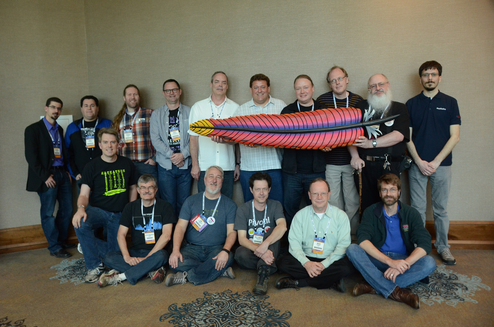

# The New Hotness In httpd 2.4

Rich Bowen, Executive Vice President

The Apache Software Foundation

rbowen@apache.org

Slides: http://boxofclue.com/ 

---

## Things have come a long way ...

---

---

## LOTS of new stuff

Let's dive right in

(Assume appropriate marketing hyperbole here: New and Improved)

Note:

    2.4 is httpd for the cloud, and so many of the features are geared
    in that direction.

---

## Run-time Loadable MPMs

* Multiple MPMs can now be built as loadable modules at compile time. 
* The MPM of choice can be configured at run time.
* Previously: You had to rebuild/reinstall to try a different MPM

---

## Loadable MPMs

Build:

   ./configure --enable-mpms-shared=all 

Configure:

    LoadModule mpm_event_module modules/mod_mpm_event.so

---

## Event MPM

* The Event MPM is no longer experimental but is now fully supported.

* Default on most modern operating systems

* Prefork has been default since forever

---

## Per-module and per-directory LogLevel configuration

* The LogLevel can now be configured per module and per directory. 

* New levels trace1 to trace8 have been added above the debug log level.

---

## Per-module configuration

    LogLevel info ssl:warn

Get the log info from just the module you're interested in

---

## Per-directory configuration

    LogLevel info
    <Directory "/usr/local/apache/htdocs/app">
      LogLevel debug
    </Directory>

Just log the app that you know is giving you problems.

---

## Per-request configuration sections

* <If>, <ElseIf>, and <Else> sections can be used to set the configuration based on per-request criteria.

* This is THE killer feature for 2.4, IMHO

---

## Example

    # Compare the host name to example.com and 
    # redirect to www.example.com if it matches
    <If "%{HTTP_HOST} == 'example.com'">
        Redirect permanent / http://www.example.com/
    </If>

* Previously, this would be a twisty maze of RewriteRules

* More examples in a moment.

---

## mod_macro

* Formerly a third-party module

* Now part of 2.4

* Macros in your config file

---

## mod_macro example

* The Macro:

        <Macro VHost $name $domain>
            <VirtualHost *:80>
                ServerName $domain
                ServerAlias www.$domain

                DocumentRoot /var/www/vhosts/$name
                ErrorLog /var/log/httpd/$name.error_log
                CustomLog /var/log/httpd/$name.access_log combined
            </VirtualHost>
        </Macro>

---

## mod_macro example

* Invoke with:

    # Create three vhosts
    Use VHost example example.com
    Use VHost myhost hostname.org
    Use VHost apache apache.org

    # Clean up
    UndefMacro VHost

---

## General-purpose expression parser

* A new expression parser allows to specify complex conditions using a common syntax in directives 

* SetEnvIfExpr, RewriteCond, Header, <If>, and others.

---

## Examples follow

* Everything here possible before, with dozens of nasty, fragile RewriteRule directives.

---

## Example

    # Compare the host name to example.com and 
    # redirect to www.example.com if it matches
    <If "%{HTTP_HOST} == 'example.com'">
        Redirect permanent / http://www.example.com/
    </If>

---

## Example

    # Force text/plain if requesting a file with the 
    # query string contains 'forcetext'
    <If "%{QUERY_STRING} =~ /forcetext/">
        ForceType text/plain
    </If>

---

## Example

        # Only allow access to this content during business hours
        <Directory "/foo/bar/business">
            Require expr "%{TIME_HOUR} -gt 9 && %{TIME_HOUR} -lt 17"
        </Directory>

---

## Example

    # Images should be from local pages
    # (Prevent image "hotlinking")
    <FilesMatch \.(jpg|png|gif)$>
        <If "%{HTTP_HOST} !~ 'example.com'>
            Require all denied
        </If>
    </FilesMatch>

---

## KeepAliveTimeout in milliseconds

* It is now possible to specify KeepAliveTimeout in milliseconds.

* Wait a fraction of a second, rather than causing idle child processes to block new requests

---

## NameVirtualHost directive

* No longer needed and is now deprecated.

* Most common misconfiguration of virtual hosts

---

## Before

    NameVirtualHost *:80

    <VirtualHost *:80>
        ServerName foo.com
        ...
    </VirtualHost>

    <VirtualHost *:80>
        ServerName bar.com
        ...
    </VirtualHost>

---

Now
===

    <VirtualHost *:80>
        ServerName foo.com
        ...
    </VirtualHost>

    <VirtualHost *:80>
        ServerName bar.com
        ...
    </VirtualHost>

---

## Huh?

* Seems trivial, but when the NameVirtualHost doesn't match the VirtualHost line, bad things happen, and the wrong vhost may be served

* This happens a lot

* This change was mostly made because the support community was sick of this question

---

## Override Configuration

The new AllowOverrideList directive allows more fine grained control which directives are allowed in .htaccess files.

    AllowOverride None
    AllowOverrideList Redirect RedirectMatch

---

## Config file variables

* It is now possible to `Define` variables in the configuration, allowing a clearer representation if the same value is used at many places in the configuration.

* The other killer feature of 2.4

---

## Define

    Define docroot /var/www/htdocs

    DocumentRoot ${docroot}
    <Directory ${docroot}>
        Require all granted
    </Directory>

* See also: mod_macro

---

## New Modules

* Lots of new modules

* This list is not exhaustive

---

## mod_proxy_fcgi and mod_proxy_scgi

FastCGI and SCGI Protocol backends for mod_proxy

---

## fcgi + proxypass

        ProxyPassMatch ^/(.*\.php(/.*)?)$ \
           fcgi://127.0.0.1:9000/var/www/vhosts/drbacchus/$1

* php-fpm info at http://php-fpm.org/

Note:

This is the new approved way to run PHP

---

## mod_proxy_express

* Provides dynamically configured mass reverse proxies for mod_proxy

* Autogenerates blocks that would otherwise look like:

        ProxyPass / backend.server:port
        ProxyPassReverse / backend.server:port

---

## ProxyExpress map file

    ##
    ## express-map.txt:
    ##

    www1.example.com http://192.168.211.2:8080
    www2.example.com http://192.168.211.12:8088
    www3.example.com http://192.168.212.10

---

## Create DBM file

    httxt2dbm -i express-map.txt -o proxymap.db

---

## Configuration

    ProxyExpressEnable on
    ProxyExpressDBMFile /path/to/proxymap.db

---

## mod_remoteip

* Replaces the apparent client remote IP address and hostname for the request with the IP address list presented by a proxies or a load balancer via the request headers.

* Prevents having to jump through hoops to get the remote IP logged on servers behind a proxy

---

## mod_heartmonitor, mod_lbmethod_heartbeat

Allow mod_proxy_balancer to base loadbalancing decisions on the number of active connections on the backend servers.

---

## mod_proxy_html

* Formerly a third-party module, this supports fixing of HTML links in a reverse proxy situation, where the backend generates URLs that are not valid for the proxy's clients.

* For example, a back-end app with hostnames in URLs embedded in the HTML

---

## mod_sed

An advanced replacement of mod_substitute, allows to edit the response body with the full power of sed.

    # In the following example, the sed filter
    # will change the string # "monday" to "MON"
    # and the string "sunday" to SUN in html documents
    # before sending to the client.

    <Directory "/var/www/docs/sed"> 
        AddOutputFilter Sed html 
        OutputSed "s/monday/MON/g" 
        OutputSed "s/sunday/SUN/g" 
    </Directory> 

---

## mod_auth_form

* Enables form-based authentication.

* Not as easy as it sounds

* See the docs

---

## mod_session

* Enables keeping session state for clients, using cookie or database storage.

* Also not as easy as it sounds

---

## mod_lua

* Embeds the Lua language into httpd, for configuration and small business logic functions. (Experimental)

* Like mod_perl, but Lua

* Easier than it sounds

---

## mod_log_debug

Allows to add customizable debug logging at different phases of the request processing.

    <Location /foo/>
      LogMessage "subrequest to /foo/" \
        hook=type_checker expr=%{IS_SUBREQ}
    </Location>

Can specify a hook (phase of transaction) and an expression to check

---

## Example

    <Location />
        LogMessage "%{reqenv:X-Foo}" hook=all
    </Location>

---

* Together with microsecond time stamps in the error log, hook=all also lets you determine the times spent in the different parts of the request processing.

        LogMessage '.' hook=all

Yields:

        [Fri Sep 18 14:51:51.000589 2015] [log_debug:info] [pid 26695:tid 140000938407680] [client 127.0.0.1:44269] .
        [Fri Sep 18 14:51:51.000627 2015] [log_debug:info] [pid 26695:tid 140000938407680] [client 127.0.0.1:44269] .
        [Fri Sep 18 14:51:51.000641 2015] [log_debug:info] [pid 26695:tid 140000938407680] [client 127.0.0.1:44269] .
        [Fri Sep 18 14:51:51.000671 2015] [log_debug:info] [pid 26695:tid 140000938407680] [client 127.0.0.1:44269] .
        [Fri Sep 18 14:51:51.000677 2015] [log_debug:info] [pid 26695:tid 140000938407680] [client 127.0.0.1:44269] .
        [Fri Sep 18 14:51:51.000684 2015] [log_debug:info] [pid 26695:tid 140000938407680] [client 127.0.0.1:44269] .
        [Fri Sep 18 14:51:51.000693 2015] [log_debug:info] [pid 26695:tid 140000938407680] [client 127.0.0.1:44269] .
        [Fri Sep 18 14:51:51.000702 2015] [log_debug:info] [pid 26695:tid 140000938407680] [client 127.0.0.1:44269] .
        [Fri Sep 18 14:51:51.000712 2015] [log_debug:info] [pid 26695:tid 140000938407680] [client 127.0.0.1:44269] .
        [Fri Sep 18 14:51:51.000778 2015] [log_debug:info] [pid 26695:tid 140000938407680] [client 127.0.0.1:44269] .

---

## mod_ratelimit

* Provides Bandwidth Rate Limiting for Clients

* Another very frequently requested feature

        <Location /downloads>
            SetOutputFilter RATE_LIMIT
            SetEnv rate-limit 400 
            # That's KB/s
        </Location>

---

## Require

* Long the bane of httpd admin's life

* Never does quite what you wanted

* Far too limiting

* New and Improved! (Washes brighter!)

---

## Require

Replaces nasty old order/allow/deny crap

        Require all granted

Access is allowed unconditionally.

        Require all denied

Access is denied unconditionally.

---

## Require

        Require env env-var [env-var] ...

Access is allowed only if one of the given environment variables is set.

        Require method http-method [http-method] ...

Access is allowed only for the given HTTP methods.

---

## IP/Host

    Require ip 10 172.20 192.168.2
    Require host example.com
    Require local

Note:

Require local is magical, and works for all meanings of 'local', both IPv4 and IPv6 and 'localhost'

---

## Require

Require expr expression
    Arbitrary expressions

* As seen in earlier example ...

      Require expr "%{TIME_HOUR} -ge 9 
            && %{TIME_HOUR} -le 17"

---

## Combining Requirements

    <RequireAll>
        Require method GET POST OPTIONS
        Require valid-user
    </RequireAll>

Or ...

    <RequireAny>
        Require method GET POST OPTIONS
        Require valid-user
        Require local
    </RequireAny>

---

## Example

    <Directory /www/mydocs>
        <RequireAll>
            <RequireAny>
                Require user superadmin
                <RequireAll>
                    Require group admins
                    Require ldap-group cn=Administrators,o=Airius
                    <RequireAny>
                        Require group sales
                        Require ldap-attribute dept="sales"
                    </RequireAny>
                </RequireAll>
            </RequireAny>
            <RequireNone>
                Require group temps
                Require ldap-group cn=Temporary Employees,o=Airius
            </RequireNone>
        </RequireAll>
    </Directory>

---

## FallBackResource

Actually, this was backported and is available in 2.2.

    FallBackResource /index.php

Implements the "front controller" model that you've been doing with RewriteRules up until now.

    RewriteEngine On
    RewriteCond %{REQUEST_FILENAME} !-f
    RewriteCond %{REQUEST_FILENAME} !-d
    RewriteBase /
    RewriteRule . index.php [PT]

---

## HTTP2

* In trunk, will be in 2.4 real soon
* http://httpd.apache.org/docs/trunk/mod/mod_h2.html

---

## But Wait, There's More!

* I've left out all the boring stuff.

* See http://httpd.apache.org/docs/2.4/new_features_2_4.html for everything else.

---

## More Info

httpd.apache.org/docs/2.4

rbowen@apache.org

@rbowen

\#httpd on Freenode

Slides: http://boxofclue.com/

