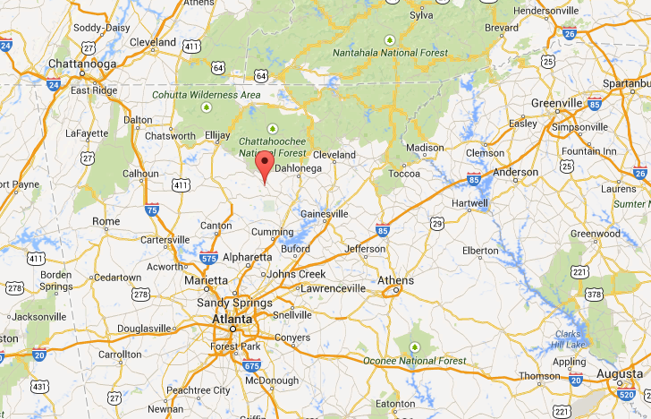
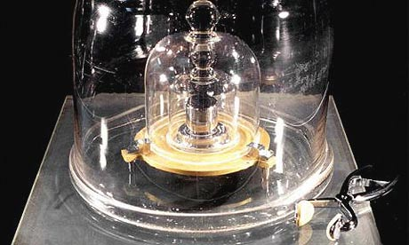
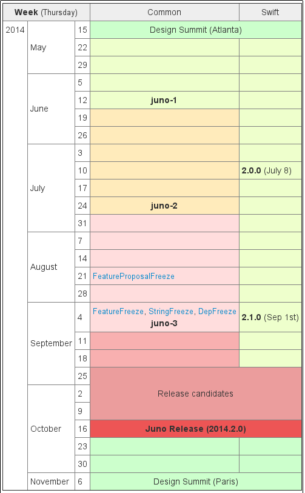
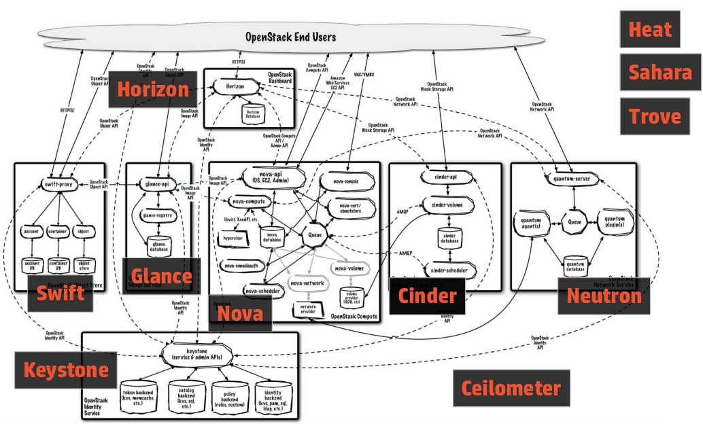
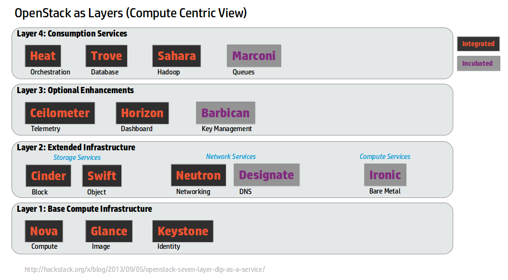
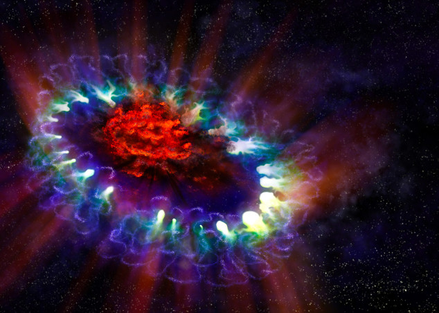
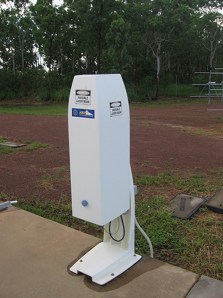

# What's new in OpenStack Juno

Rich Bowen

OpenStack Community Liaison, Red Hat

rbowen@redhat.com

---

## Follow along at [boxofclue.com](http://boxofclue.com/)

---

## Juno

* 6 month release cycle
* Alphabetic naming, related to city where design summit happened
* Austin, Bexar, Cactus, Diablo, Essex, Folsom, Grizzly, Havana, Icehouse
* Juno
* Kilo

---

## Juno

* Juno: Juno is a locality in Georgia

---

## Kilo

* Kilo: Paris (Sèvres, actually, but that's close enough) is home to the Kilogram, the only remaining SI unit tied to an artifact

---

## L

* L summit is in Vancouver
* Should see a poll for naming that in the next few months

---

## Design summit

* ATCs (Active Technical Contributors) gather to decide what happens next

* Summit in Atlanta was in April

* Many projects have a mid-term meetup to evaluate progress

---

## So, what's coming?

* Mid-term reports, and various blogs/podcasts since then
* Feature freeze September 4
* Release October 16 (Tomorrow!)

Note:

Most of this information comes from the mid-term meetups and the
mid-term reports, which happened at various times from July onwards.
Most of the PTLs then reported in a series of webcasts, and more
information comes from there.

---

 https://wiki.openstack.org/wiki/Juno_Release_Schedule

---

## Projects

* OpenStack is comprised of 22 separate projects (sort of)
* Each one is semi-independent as far as planning their roadmap

---

## Projects

* Bare metal (Ironic)
* Block Storage (Cinder)
* Common Libraries (Oslo)
* Compute (Nova)
* DNS Services (Designate)
* Dashboard (Horizon)
* Data processing service (Sahara)
* Database Service (Trove)
* Deployment (TripleO)
* Documentation (No Clever Name)
* Identity (Keystone)

---

* Image Service (Glance)
* Infrastructure (Infra)
* Key management service (Barbican)
* Message service (Zaqar, formerly Marconi)
* Networking (Neutron)
* Object Storage (Swift)
* Orchestration (Heat)
* Quality Assurance (QA)
* Release cycle management (Thierry)
* Shared File Systems (Manila)
* Telemetry (Ceilometer)

---

    This presentation doesn't cover all of the projects, so I'm most
    assuredly missing something.

---

## The components

---

## Layers

---

## New projects in Juno

* Sahara
* Barbican (Incubating)
* Designate (Incubating)
* Manila (Incubating)

---

## Sahara

    The Sahara project provides a simple means to provision a
    data-intensive application cluster (Hadoop or Spark) on top of
    OpenStack. 

* Integrated in Juno

---

## Barbican

    Barbican is a ReST API designed for the secure storage, provisioning
    and management of secrets. It is aimed at being useful for all
    environments, including large ephemeral Clouds. 

* Incubating in Juno

---

## Designate

    Designate provides DNSaaS services for OpenStack:

    * REST API for domain/record management
    * Multi-tenant
    * Integrated with Keystone for authentication
    * Framework in place to integrate with Nova and Quantum notifications (for
    * auto-generated records)
    * Support for PowerDNS and Bind9 out of the box

* Incubating in Juno

---

## Manila

    Shared filesystem service for OpenStack. Provides coordinated access
    to shared or distributed file systems.

---

## Nova

A cloud computing fabric controller - manages creation and management of
VMs.

---

### Nova: NFV

* Network Function Virtualization
* Moving networking hardware functionality to software
* Closely related to, but subtly different from, Software Defined Networking (SDN)
* https://wiki.openstack.org/wiki/Teams/NFV

---

### NFV in Nova

* Nova adding support for NFV functions
* Ability to talk to underlying hardware for networking functionality
* NFV support will also be added in Neutron (Networking)

---

### Nova: Live Upgrades

* Two versions ago, the upgrade process was "burn it down and start over"
* In Icehouse, live upgrades were introduced, but still a little rocky
* In Juno, you should be able to actually do a live upgrade without downtime

---

### Nova: More

* http://blog.russellbryant.net/2014/07/07/juno-preview-for-openstack-compute-nova/

---

## Ceilometer

* Metering
* Billing
* Alarms

---

### Ceilometer: Speed

* Identified poor design decisions that can be changed for performance improvementA
* State data was being stored with large amounts of resource metadata that seldom (if ever) changes.
* State snapshots containing huge amounts of duplicated data
* Now data points are stored without this repeated metadata
* Result: faster data read/write

---

### Ceilometer: Community reboot

* Move from top-down decision making to a collaborative community approach
* Earlier deadline on new functionality, so that everything is in before feature freeze

Note:

The project management is moving from a top-down decision making process
to a collaborative community decision making process, so that everyone
has a voice in how decisions are being made.

Additionally, some controls are being put in place regarding the code
freeze at the end of the cycle, so that people aren't trying to rush new
functionality in at the last minute, resulting in testing gaps.

---

### Ceilometer: QA

* Better Tempest/Grenade test coverage
* Improvement of existing tests, so that they'll actually run in the gate

Note:

Speaking of testing, there's also an effort to ensure more Tempest and
Grenade test coverage in Juno, which should ensure better code
reliability.

---

### Ceilometer: More

* http://community.redhat.com/blog/2014/07/upstream-podcast-episode-10-rich-bowen-with-eoghan-glynn-on-openstack-juno/

---

## Heat

Orchestration - Deploy and tear down infrastructure automatically, using templates to define what it's supposed to look like

Works with Ceilometer to respond to alarms

Note:

Can be in response to environmental events, or scripted.

---

### Heat: Rollback

* Before, if a deploy failed, there was no good way to clean up
* Might end up with random pieces orphaned around your data center
* In Juno, easier to rollback an entire deployment, cleaning up all of the pieces

---

### Heat: Create resources without being admin

* Some resources can only be created as admin
* This made certain deployments difficult or impossible for non-admin users
* In Juno, a sudo-ish functionality will allow you to delegate these functions to users, so that they can do it themselves
* Creating/managing users still an admion-only function

### Heat: More

* http://www.zerobanana.com/archive/2014/07/10#heat-juno-update

---

## Glance

* Previously, a store for your VM images
* Now, it's more:

    Glance is "a service where users can upload and discover data assets
    that are meant to be used with other services, like images for Nova
    and templates for Heat."

---

### Glance: Artifacts

* 'Artifacts', rather than just being images, are now generic data assets
* Greater flexibility in how it can be used
* Store objects that need to be shared across multiple instances

Note:

The scope is expanding in Juno to be more than just an image registry,
to being a generic catalog of various data assets. This will allow for
greater flexibility in how it can be used.

---

### Glance: More

* http://blog.flaper87.com/post/juno-preview-glance-marconi/

---

## Marconi (Zaqar)

* Messaging queue
* Sits on top of your favorite message queue to provide a standard interface
* rabbitmq, qpid, etc

---

### Zaqar: New name

* Renamed to Zaqar due to copyright

    In Mesopotamian mythology, Zaqar or Dzakar is the messenger of the god Sin. He relays these messages to mortals through his power over their dreams and nightmares.

---

### Zaqar: Redis

* In Juno, Marconi will add a storage driver to support redis
* Support for storage engines is in the works
* It will be possible to create and tag clusters of storage and then use them based on their capabilities

---

### Zaqar: Queues migration

* Add the ability to migrate queues between pools of the same type
* https://blueprints.launchpad.net/marconi/+spec/queue-migration

---

### Zaqar: More

* http://blog.flaper87.com/post/juno-preview-glance-marconi/ 

---

## Keystone

Identity management

Handles any request for credentials from any other component

---

### Keystone: LDAP integration

* Having a separate authentication database is annoying
* You want to use your existing corporate auth store, which is probably LDAP
* Keystone adds the ability to use multiple identity backends, making integration with LDAP much easier

Note:

Using Keystone against a database is ok, in that it does password
authentication. But what you really want is to integrate it with your
existing user authentication infrastructure. This often means LDAP. In
Juno, you can configure Keystone to use multiple identity backends, and
integration with LDAP will be much easier.

---

### Keystone: Barbican

* https://wiki.openstack.org/wiki/Barbican
* Secure storage, provisioning, and management of secrets
* Not actually part of Keystone, just of interest

---

### Keystone: Kite

"The easiest ways to get keys in the cloud"

Still in infancy

Works in conjunction with Barbican to provide secure key-based authentication

Sub-project of Barbican

---

### Keystone: More

* http://redhatstackblog.redhat.com/2014/08/05/juno-updates-security/
* https://blog-nkinder.rhcloud.com/?p=130

---

## TripleO

* Install, upgrade, and operate OpenStack in an automated fashion
* https://wiki.openstack.org/wiki/TripleO
* Major focus of Juno is making clouds easier to deploy and manage
* Extensive notes on Juno plans at https://wiki.openstack.org/wiki/TripleO/TuskarJunoPlanning

---

### TripleO: Auto-scaling

* Auto-scale deployments based on various measures
* Manage the auto-scaled cloud
* Strategy of "victim" in scale-down (ie, oldest-first, or newest-first)

---

### TripleO: Heat templates

* TripleO uses Heat as part of the automation of deployment
* In Juno a lot of work has gone into the Heat templates that are used

---

### TripleO: Metric graphs

* Integration with Ceilometer to provide usage graphs
* Health metric for nodes

---

### TripleO: More

* http://blog-slagle.rhcloud.com/?p=235

---

## Horizon

Horizon is the "dashboard" - the web interface for OpenStack

The main (or at least first) interface for many users, so it needs to be slick.

---

### Horizon: Sahara (Hadoop)

* Recently incubated project
* Deploy Apache Hadoop or Apache Spark on OpenStack
* Now integrated into the Horizon dashboard

---

### Horizon: JavaScript unbundling

* Previously large amounts of JavaScript were bundled into the OpenStack
  release
* Have been unbundled, and are installed as dependencies
* Makes it easier to manage upgrades
* Avoid conflicting installed versions
* Complies with no-bundling requirements in certain Linux distros like Fedora.

---

### Horizon: More

* http://www.matthias-runge.de/2014/09/08/horizon-juno-cycle-features/

---

## See also

* This is *not* comprehensive
* See also https://openstack.redhat.com/Juno_previews
* See also the YouTube playlist of PTL (Project Technical Lead) webinars at http://goo.gl/jbL909
* Come to the OpenStack Summit in Paris - http://openstack.org/summit to see what we'll do for an encore in Kilo.

---

## FINIS

Email: rbowen@redhat.com

Twitter: @rbowen, @rdocommunity

Slides: http://boxofclue.com/presentations/

RDO: http://openstack.redhat.com/

